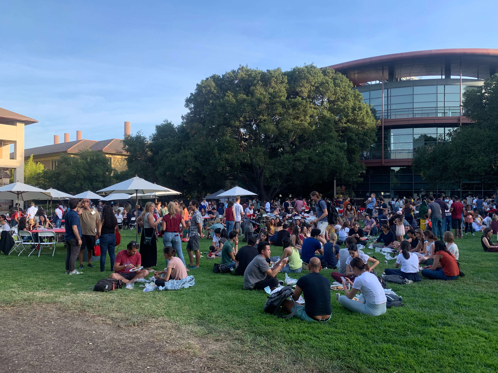
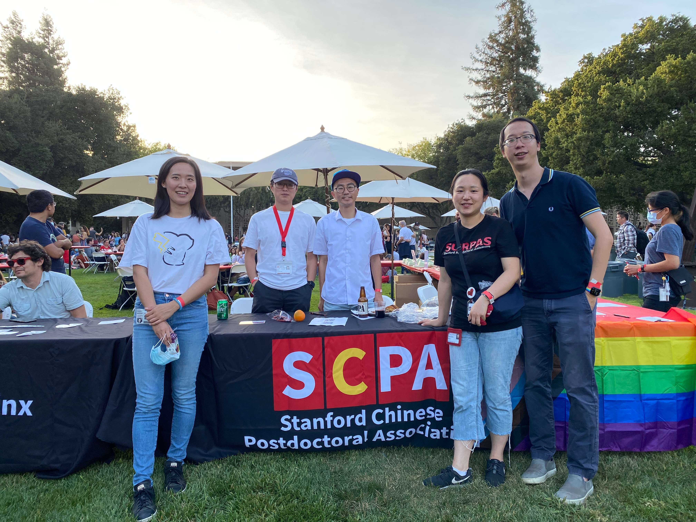
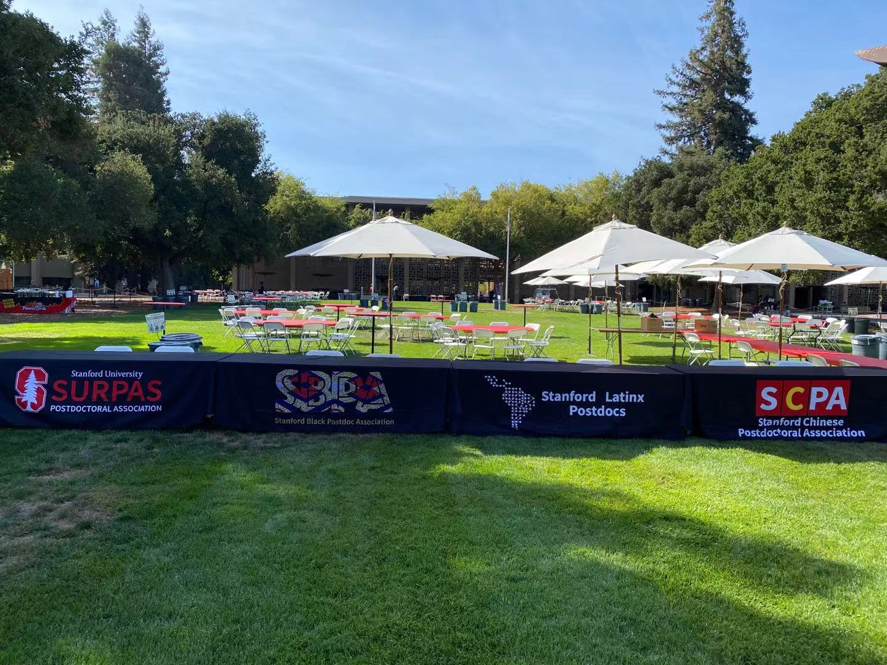

---
authors:
- xiaotao-shen
categories:
- meeting
date: "2021-09-26T00:00:00Z"
draft: false
featured: false
image:
  caption: ''
  focal_point: ""
  placement: 2
  preview_only: false
lastmod: "2021-09-26T00:00:00Z"
projects: []
subtitle: ""
summary: "2021年9月份NPAW BBQ"
tags:
- meeting
title: 2021年9月份NPAW BBQ
---

NPAW周四(2021年9月23号)是斯坦福所有博后的BBQ.最后参加的人非常多,大概有1000人左右.

我们SCPA也在活动现场摆上了我们的桌子,很多新来的中国博后都在这里寻找到了组织.

感谢高鹏,王楚楚博士帮我们布置现场!

最后还是欢迎所有斯坦福博后们(或者曾经的)与我们联系!我们后面会有monthly的happly hour,希望到时看到大家.

---

---

# **关于SCPA**

斯坦福中国博士后协会(Stanford Chinese Postdoctoral Association, SCPA)是斯坦福所有中国(华人)博士后的组织.我们欢迎所有在斯坦福的中国/华人博士后加入到我们协会.我们的使命是促进中国/华人博士后的交流,学习,并为他们的学习,工作和生活提供力所能及的帮助.

非常欢迎大家跟我们联系,交流.

## 微信公众号
该微信公众号是SCPA的官方微信公众号,欢迎大家关注!

[Wechat offical account](https://www.shenxt.info/files/scpa_wechat.jpeg)

## SCPA官网
SCPA官方网站.
https://scpa.netlify.app/
点击阅读原文访问.

## SCPA官方微信群
欢迎加入SCPA博后访问学者微信群.
添加群主微信(shenxt1990).

[Wechat group](https://www.shenxt.info/files/wechat_QR.jpg)

## SCPA Stanford Email list
点击该链接[https://mailman.stanford.edu/mailman/listinfo/chinesepostdocs](https://mailman.stanford.edu/mailman/listinfo/chinesepostdocs).加入我们的email list.
