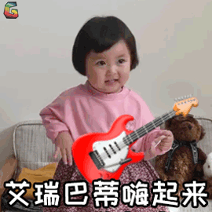
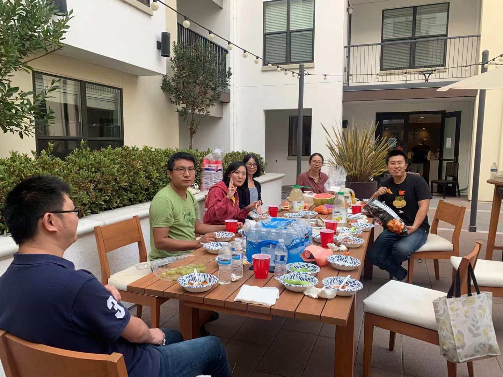
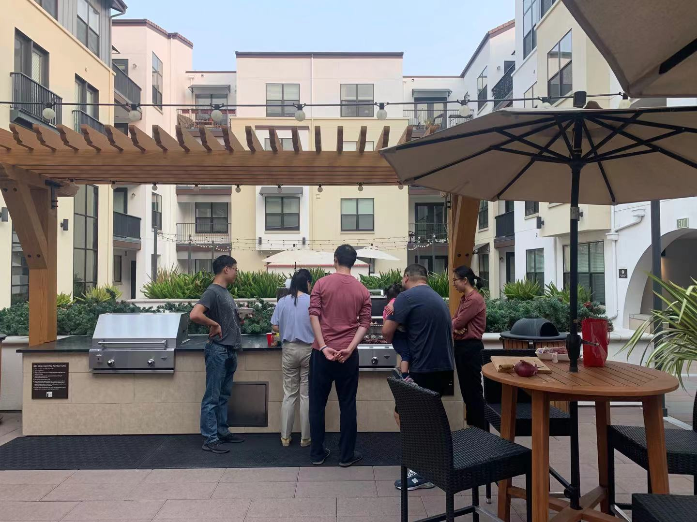
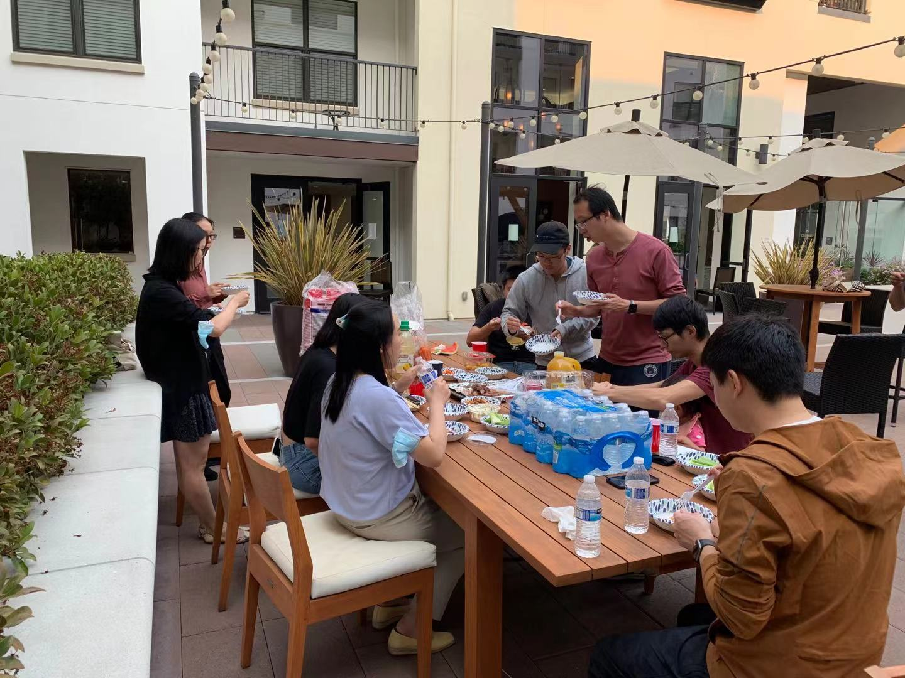
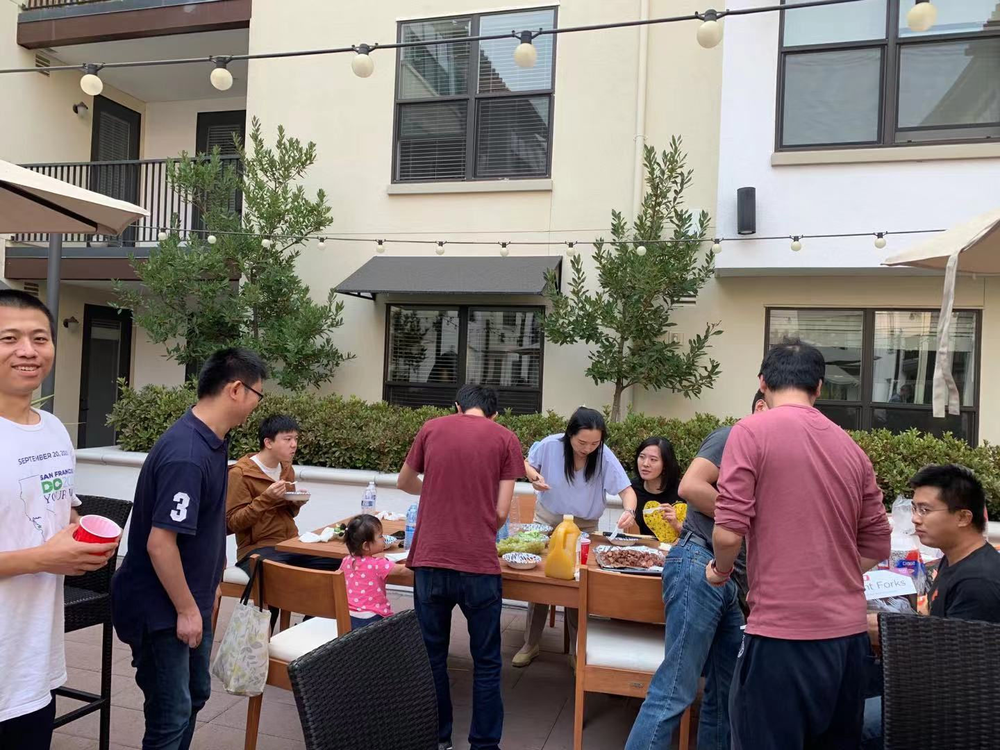

---
authors:
- xiaotao-shen
categories:
- meeting
date: "2021-09-26T00:00:00Z"
draft: false
featured: false
image:
  caption: ''
  focal_point: ""
  placement: 2
  preview_only: false
lastmod: "2021-09-26T00:00:00Z"
projects: []
subtitle: ""
summary: "2021年9月份SCPA happy hour"
tags:
- meeting
title: 2021年9月份SCPA happy hour
---

SCPA已经申请到了OPA每个月的资金支持,我们每个月会有大概100刀左右的资金用来happy hour.

这次九月份的happy hour是跟Xin Zhou和Chuchu Wang博士主持的Stanford Omics Community的年终聚会一起合办的.

# 关于SCPA happy hour

> SCPA是斯坦福大学的官方组织.我们每个月都会有happly hour(每个月的最后一个周末,周五,周六或者周日),希望让大家认识新朋友,互相交流.想要获得最新消息的同学们,请关注我们公众号并加入我们的群聊(见下面内容),期望下次聚会见到大家!

# 关于Stanford Omics Community

> Stanford Omics Community是由Xin Zhou和Chuchu Wang博士组织的跟组学相关的学术组织,我们每周五下午会请一个相关领域的专家(博士,博士后以及教授等)来做一个小时的报告.促进大家之间的学术交流.欢迎对相关领域感兴趣的专家加入!想要直接加入的同学可以直接联系Xin Zhou博士(zx13564431387)或者Chuchu Wang博士(choicewang).

**感谢王楚楚,周欣和高鹏博士组织这次聚会!**

期待下次见到其他新朋友!

---

# **关于SCPA**

斯坦福中国博士后协会(Stanford Chinese Postdoctoral Association, SCPA)是斯坦福所有中国(华人)博士后的组织.我们欢迎所有在斯坦福的中国/华人博士后加入到我们协会.我们的使命是促进中国/华人博士后的交流,学习,并为他们的学习,工作和生活提供力所能及的帮助.

非常欢迎大家跟我们联系,交流.

## 微信公众号
该微信公众号是SCPA的官方微信公众号,欢迎大家关注!

[Wechat offical account](https://www.shenxt.info/files/scpa_wechat.jpeg)

## SCPA官网
SCPA官方网站.
https://scpa.netlify.app/
点击阅读原文访问.

## SCPA官方微信群
欢迎加入SCPA博后访问学者微信群.
添加群主微信(shenxt1990).

[Wechat group](https://www.shenxt.info/files/wechat_QR.jpg)

## SCPA Stanford Email list
点击该链接[https://mailman.stanford.edu/mailman/listinfo/chinesepostdocs](https://mailman.stanford.edu/mailman/listinfo/chinesepostdocs).加入我们的email list.
