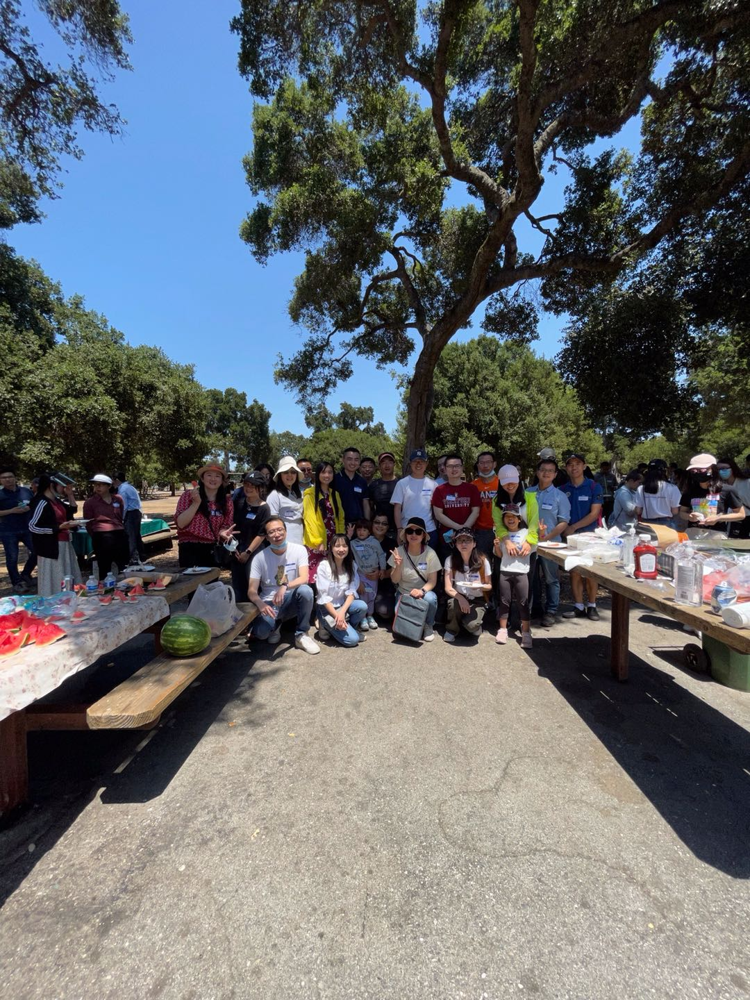

---
authors:
- xiaotao-shen
categories:
- 联谊
date: "2021-08-28T00:00:00Z"
draft: false
featured: false
image:
  caption: ''
  focal_point: ""
  placement: 2
  preview_only: false
lastmod: "2021-08-28T00:00:00Z"
projects: []
subtitle: ""
summary: "2020年初，一场突如其来的COVID19疫情，让斯坦福中国博士后协会(Stanford Chinese Postdoctoral Association, SCPA)的许多活动被迫停办。加州解封之后，我们终于部分的恢复到了正常的生活！SCPA也立即行动起来，经斯坦福博士后办公室的同意，在众多志愿者的努力下，一年一度的斯坦福中国博士后协会年度BBQ活动得以延续，在这个周六（2021年7月10号）圆满举办！"
tags:
- 联谊
title: 斯坦福中国博士后协会2021年度BBQ圆满结束!
---

2020年初，一场突如其来的COVID19疫情，让斯坦福中国博士后协会(Stanford Chinese Postdoctoral Association, SCPA)的许多活动被迫停办。加州解封之后，我们终于部分的恢复到了正常的生活！SCPA也立即行动起来，经斯坦福博士后办公室的同意，在众多志愿者的努力下，一年一度的斯坦福中国博士后协会年度BBQ活动得以延续，在这个周六（2021年7月10号）圆满举办！
 
作为解除居家令后的第一次活动，我们依然遇到了种种困难，也未能邀请到未接种疫苗的斯坦福博后或者其家庭成员的参与。尽管如此，此次活动的参与人数仍然超出了我们的预期，有约110人的积极参与!
 
首先感谢斯坦福中国博士后、中国学者的积极参与。尤其是近一个月以来，积极参与筹划的20多位志愿者。比如，王楚楚、潘辰杰、高鹏、赵祥、王晴、潘杰、孙颖、申小涛、刘强、杨刚、左政、杨帆等人的辛勤努力，才换来了这次BBQ活动成功举办，给了大家在一年多疫情之后能够互相交流的机会!

---

# **关于SCPA**

斯坦福中国博士后协会(Stanford Chinese Postdoctoral Association, SCPA)是斯坦福所有中国(华人)博士后的组织.我们欢迎所有在斯坦福的中国/华人博士后加入到我们协会.我们的使命是促进中国/华人博士后的交流,学习,并为他们的学习,工作和生活提供力所能及的帮助.

非常欢迎大家跟我们联系,交流.

## 微信公众号
该微信公众号是SCPA的官方微信公众号,欢迎大家关注!

[Wechat offical account](https://www.shenxt.info/files/scpa_wechat.jpeg)

## SCPA官网
SCPA官方网站.
https://scpa.netlify.app/
点击阅读原文访问.

## SCPA官方微信群
欢迎加入SCPA博后访问学者微信群.
添加群主微信(shenxt1990).

[Wechat group](https://www.shenxt.info/files/wechat_QR.jpg)

## SCPA Stanford Email list
点击该链接[https://mailman.stanford.edu/mailman/listinfo/chinesepostdocs](https://mailman.stanford.edu/mailman/listinfo/chinesepostdocs).加入我们的email list.

