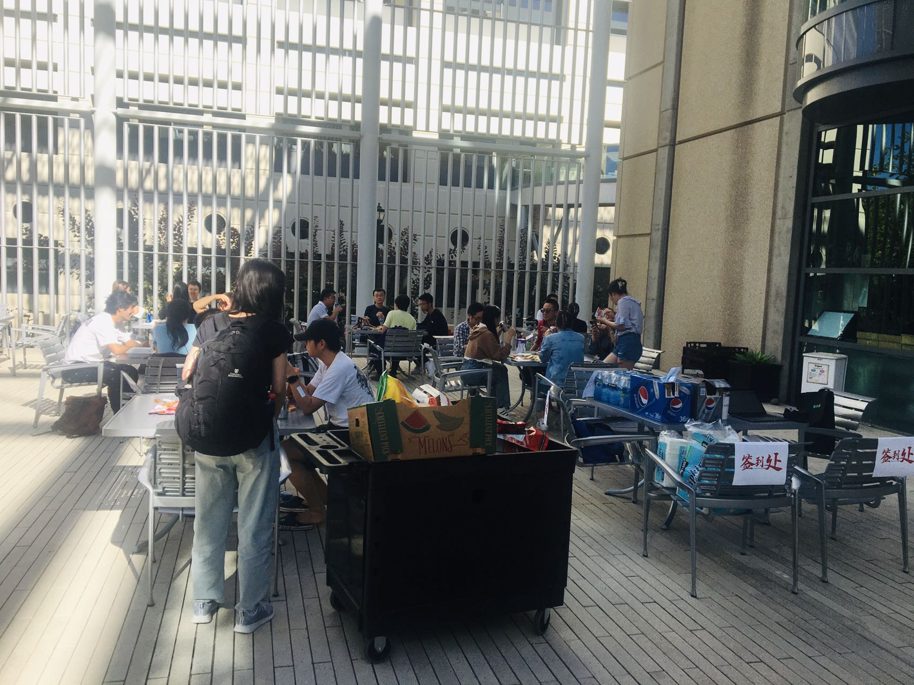
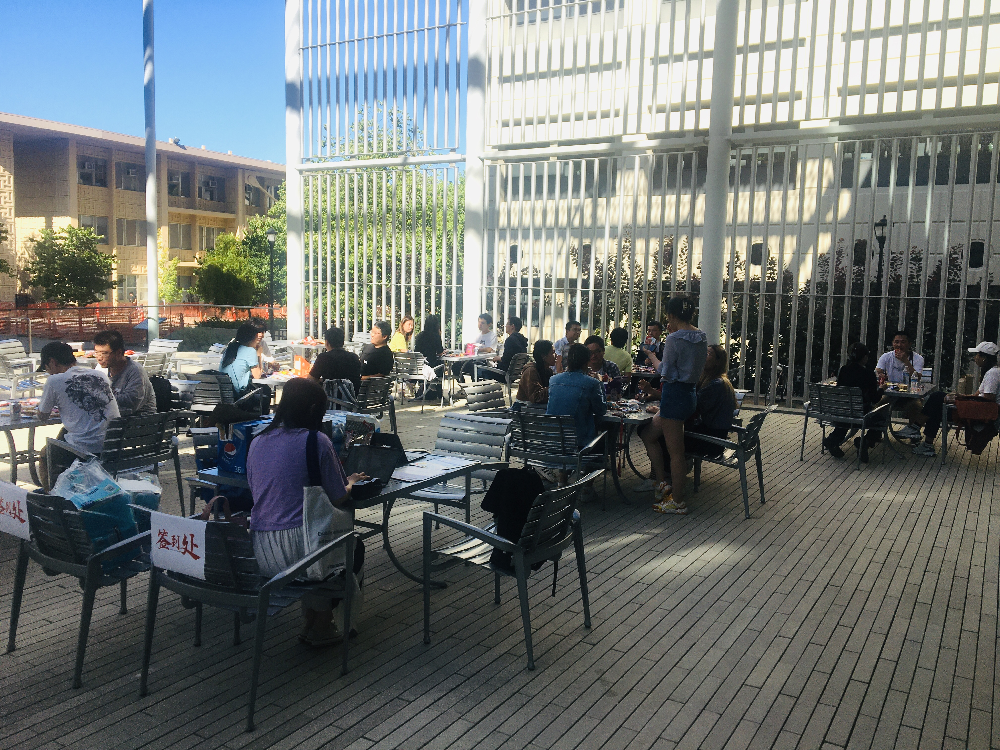

---
authors:
- chuchu-wang
- xiaotao-shen
categories:
- meeting
date: "2023-07-28T00:00:00Z"
draft: false
featured: false
commentable: true
editable: true
image:
  caption: ''
  focal_point: ""
  placement: 2
  preview_only: false
lastmod: "2023-07-28T00:00:00Z"
projects: []
subtitle: ""
summary: "斯坦福大学中国博士后协会2023年7月happy hour"
tags:
- meeting
title: 斯坦福大学中国博士后协会2023年7月happy hour
---

在一个充满活力和欢乐的氛围中，斯坦福大学中国博后部（SCPA）于今天举行了7月份的**happy hour**聚会。这次活动吸引了来自中国各个研究领域的博士后学者，他们汇聚在一起，共同享受着这个特别的社交聚会。

SCPA一直致力于为中国博士后学者提供一个融洽交流的平台，这次欢乐时光也不例外。活动现场，参与者们欢聚一堂，自由地交流他们在各自研究领域的最新进展和发现，都有精彩的讨论和激发灵感的交流。

除了学术话题，参与者们还分享了关于他们在斯坦福大学及周边地区的生活经验。这对于许多刚刚来到斯坦福的中国博士后学者来说尤为重要，因为他们能够从有经验的学长学姐们那里获取到宝贵的建议和指导，让他们更好地适应新的环境。

为了增添欢乐时光的趣味性，组织者们还准备了丰富多彩的游戏和节目。参与者们纷纷参加各种有趣的游戏，笑声和欢呼声不断响起，气氛相当热烈。这样的活动不仅促进了彼此之间的交流，还拉近了博士后学者们之间的距离，增进了大家的友谊。

在结束的时候，SCPA的负责人发表了热情洋溢的致辞，感谢所有参与者的积极参与和支持。他们表示SCPA将继续举办类似的活动，为中国博士后学者们创造更多交流和分享的机会。

整个活动在融洽的氛围中圆满结束。通过这次7月份的happy hour，斯坦福大学中国博后部（SCPA）再次展现出其积极向上、团结友爱的特质，为中国博士后学者们搭建起了一个共同成长的家园。

本次活动由王楚楚博士，赵曼主席和朱少原主席组织。

By ChatGPT

---

---

# **关于SCPA**

斯坦福中国博士后协会(Stanford Chinese Postdoctoral Association, SCPA)是斯坦福所有中国(华人)博士后的组织.我们欢迎所有在斯坦福的中国/华人博士后加入到我们协会.我们的使命是促进中国/华人博士后的交流,学习,并为他们的学习,工作和生活提供力所能及的帮助.

非常欢迎大家跟我们联系,交流.

## 微信公众号

SCPA的官方微信公众号,欢迎大家关注!

[Wechat offical account](https://www.shenxt.info/files/scpa_wechat.jpeg)

## SCPA官网

https://scpa.netlify.app/

## SCPA官方微信群

欢迎加入SCPA博后访问学者微信群.
添加群主微信(zhuzhusy90，zhaoman-123456).

[Wechat group](https://www.shenxt.info/files/wechat_QR.jpg)

## SCPA Stanford Email list

点击该链接[https://mailman.stanford.edu/mailman/listinfo/chinesepostdocs](https://mailman.stanford.edu/mailman/listinfo/chinesepostdocs).加入我们的email list.

