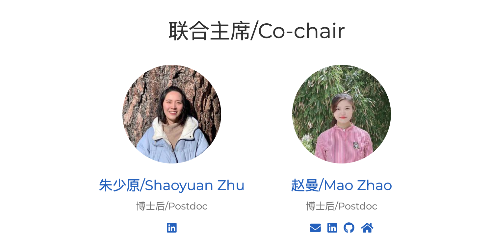

---
authors:
- xiaotao-shen
categories:
- meeting
date: "2023-07-07T00:00:00Z"
draft: false
featured: false
commentable: true
image:
  caption: ''
  focal_point: ""
  placement: 2
  preview_only: false
lastmod: "2023-07-07T00:00:00Z"
projects: []
subtitle: ""
summary: "斯坦福中国博士后协会举行换届选举，朱少原和赵曼当选"
tags:
- meeting
title: 斯坦福中国博士后协会举行换届选举，朱少原和赵曼当选
---

斯坦福，2023年7月7日——今天，斯坦福中国博士后协会（SCPA）在一次意义非凡的换届选举中迎来了新的领导团队。朱少原和赵曼两位杰出的博士后学者成功当选为协会主席和副主席，标志着SCPA进入了一个新的发展阶段。

作为斯坦福大学境内最重要的中国学者组织之一，SCPA致力于为中国博士后学者提供交流、合作和发展的平台。这次换届选举的成功举行进一步巩固了协会在促进学术研究和学者互动方面的重要作用。

朱少原是斯坦福大学分子和细胞生理学系的博士后学者。他的导师是托马斯·苏德霍夫教授，他是神经科学领域的诺贝尔奖得主，研究神经递质释放和突触功能的分子机制

赵曼是斯坦福大学放射生物学系的博士后学者。她的导师是Erinn Rankin博士，她是肿瘤微环境研究领域的专家。赵曼的研究兴趣是探索驱动肿瘤进展、转移和耐药性的分子机制，以及寻找针对晚期转移性疾病的治疗策略。赵曼的博士后研究目标是研究在透明细胞肾细胞癌（ccRCC）发生、进展和放射抵抗中起致癌作用和治疗潜力的因子

新任主席朱少原表示：“我感到非常荣幸能够担任SCPA主席，并与赵曼博士一同领导这个杰出的组织。我们将努力为所有会员提供更多有益的活动和资源，促进学术研究的发展，同时加强国际学术交流合作，为中国博士后学者在全球范围内的影响力和地位做出更大的贡献。”

同时，新任主席赵曼也表示：“我对能够成为SCPA的一员感到无比自豪，我期待与朱少原博士和全体成员一起，推动协会的发展和壮大。我们将不遗余力地打造一个积极、包容和创新的学术环境，为博士后学者们提供更多机会，推动他们在各自领域取得更大的成就。”

SCPA的换届选举为协会带来了新的活力和动力，也为中国博士后学者在斯坦福大学的发展创造了更加广阔的前景。相信在朱少原主席和赵曼副主席的带领下，SCPA将继续发挥重要作用，为博士后学者们提供更多发展机会和国际交流平台，为中国学术界的繁荣做出积极贡献。

关于斯坦福中国博士后协会（SCPA）：
斯坦福中国博士后协会（SCPA）是斯坦福大学境内最重要的中国学者组织之一，致力于为中国博士后学者提供学术交流和合作的平台。协会定期组织讲座、研讨会和学术交流活动，促进学者们在各自领域的进一步发展，并与国内外学术机构建立广泛的合作关系。

By- ChatGPT

---

---

# **关于SCPA**

斯坦福中国博士后协会(Stanford Chinese Postdoctoral Association, SCPA)是斯坦福所有中国(华人)博士后的组织.我们欢迎所有在斯坦福的中国/华人博士后加入到我们协会.我们的使命是促进中国/华人博士后的交流,学习,并为他们的学习,工作和生活提供力所能及的帮助.

非常欢迎大家跟我们联系,交流.

## 微信公众号
该微信公众号是SCPA的官方微信公众号,欢迎大家关注!

[Wechat offical account](https://www.shenxt.info/files/scpa_wechat.jpeg)

## SCPA官网
SCPA官方网站.
https://scpa.netlify.app/
点击阅读原文访问.

## SCPA官方微信群
欢迎加入SCPA博后访问学者微信群.
添加群主微信(zhuzhusy90，zhaoman-123456).

[Wechat group](https://www.shenxt.info/files/wechat_QR.jpg)

## SCPA Stanford Email list
点击该链接[https://mailman.stanford.edu/mailman/listinfo/chinesepostdocs](https://mailman.stanford.edu/mailman/listinfo/chinesepostdocs).加入我们的email list.
